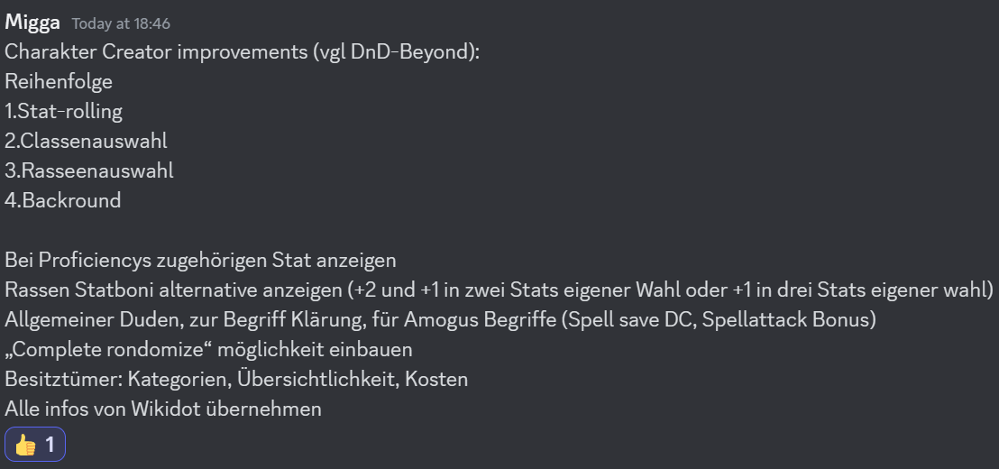

# Character Erstellung - Konzeptierung

## Meeting vom Samstag, 17. Feb 2024

### Agenda

- Introduction
- Die Roadmap
- Charakter Erstellung als erstes Feature
- Anforderungen sammeln --> Workshop
- User Stories erstellen

### User Stories

Als **Spieler** möchte ich bei der Character Erstellung für die Proficiencies bzw. Übungen die dazugehörigen Stats angezeigt bekommen, damit mir es leicher fällt, den Überblick über meinen Character zu behalten.

Als Spieler möchte ich Regelwerke zu- und abwählen können, damit ich mir nur die "zugelassenen" Auswahlmöglichkeiten vorgeschlagen werden.

Als Spieler möchte, dass wenn ich ein Regelwerk abwähle die "Sachen" aus dem abgewählten Regelwerk nicht direkt verschwinden sondern markiert werden, damit sich keine unerklärten Leerstellen im Charakterbogen bilden.

Als Spieler möchte ich viel auf einem Screen sehen können, damit ich nicht zwischen Reitern springen muss und ich dadurch Dinge vergesse.

Ich als Spieler möchte eine Hintergrundspeicher/ Autosave System um Datenverlust durch teschnische Probleme etc. zu verhindern.

Als erfehrener Nutzer möchte ich, dass das Programm mir einen schellen und effizienten Prozess erlaubt. (Shortcuts etc.), damit ich keinen unnötig großen Zeitaufwand habe.

Als Spieler möchte ich, dass möglichst viel in der Charaktererstellung über Checkboxen und ähnliches Funktioniert, damit ich weniger schreiben muss und der Prozess schneller funktioniert.

Ich als Meister möchte alle Informationen/Regeln/Quellen übersichtlich in eine Interface haben um flüssig arbeiten zu können.

Als Nutzer dieser App möchte ich eine intuitive UI, denn eine gute Haptik ist mir wichtig.

Ich als Nutzer möchte das das Programm alle nötigen Informationen für die Erstellung bereits haben, damit ich nicht auf externen Websiten nachschlagen muss.
(Klasssen, Rassen, Items, Spells etc.)

Ich als Spieler möchte alle Entscheidungen die ich in der Erstellung getroffen habe jederzeit rückgängig machen können um meine eigenen Fehler beheben zu können bzw. Entscheidungen ändern kann.

Als erfahrener Nutzer möchte ich, dass die Erstellung offener gestaltet ist und ich nicht an eine festen Ablauf gebunden bin, damit ich frei hin- und herspringen kann und auf meine Weise den Charakter erstellen kann. 